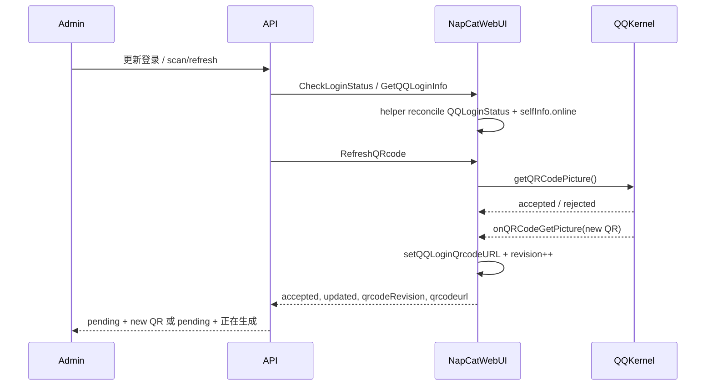

# QQBot NapCat 源码 Fork 二维码刷新修复设计

## 背景

线上账号 `1914728559` 的更新登录链路已经证明 API 侧旧二维码回传被挡住：刷新会话不再把旧 QR 传给 Admin/SSE，接口会保持 `pending` 并清空二维码。但同一个容器内的 NapCat WebUI 仍存在源头问题：

- 正确通过 `/api/auth/login` 换取 `Credential` 后，`CheckLoginStatus` 与 `GetQQLoginQrcode` 仍返回旧二维码 hash `47fb616d3f27c93a`。
- `/app/napcat/cache/qrcode.png` 的 mtime、size、sha256 不变化。
- Docker 日志只有“当前账号(1914728559)已登录,无法重复登录”，没有二维码生成日志。
- NapCat WebUI 内部 `QQLoginStatus=true` 与实际 `selfInfo.online=false` 发生分裂，导致 `RefreshQRcode` / `GetQQLoginQrcode` 被旧登录态短路。

上一轮 `kt-napcat-desktop-cn:desktop-cn-v2` 是在派生镜像里解压 `NapCat.Shell.zip` 并用脚本 patch bundled JS。这条路验证了方向，但它仍是脆弱的产物补丁：上游构建压缩、文件结构或字符串变化都会让补丁静默失效。本轮选择 fork NapCat 源码，在源代码层修复登录态与二维码刷新语义，再把源码构建产物注入 KT 受控中文桌面派生镜像。

## 目标

1. 建立 KT 可维护的 `NapCatQQ` 源码 fork，不再依赖对 `napcat.mjs` 的字符串补丁。
2. 在 NapCat WebUI 源码层修复 `QQLoginStatus=true` 但真实账号离线时的登录态误判。
3. 让 `RefreshQRcode` 的结果可观测：区分“刷新请求已被 QQ 内核接受”和“新的 QR URL 已经到达 WebUI 缓存”。
4. 让 `GetQQLoginQrcode` / `CheckLoginStatus` 不再对 stale QR 做成功式返回。
5. 保留 API 侧 fresh QR 护栏，避免未来 NapCat 或 QQ 内核异常时 Admin/SSE 再展示旧码。
6. 生成 KT 受控 `NapCat.Shell.zip` artifact，并接入 `kt-napcat-desktop-cn:desktop-cn-v3` 镜像。
7. 完成本地构建验证、镜像验证、线上单账号 canary 验证，再决定是否替换所有账号容器。

## 非目标

- 不绕过 QQ/Tencent 验证码、新设备验证或安全验证。
- 不修改 QQ/NTQQ 私有协议字段，不伪造协议签名。
- 不重写 NapCat Docker 上游镜像链路；首版继续复用 KT 的中文桌面派生镜像。
- 不删除 API 侧已完成的旧二维码防护。
- 不在登录 SSE 流程里恢复 Docker 重建、重启或运行态补 env。
- 不把 OneBot 反向 WebSocket 在线当作 QQ 账号登录成功证据。

## 源码仓库与基线

新增一个长期维护的独立源码 fork：

```text
D:\MyFiles\KT\GitHub\NapCatQQ
```

基线使用上游 `NapNeko/NapCatQQ` 的 `origin/main`，当前已审计的上游基线 commit 为：

```text
5c18a62530d87dbadf53d267002894faa6ca7e90
```

实现阶段必须重新拉取并确认实际基线。如果上游已经前进，先把本设计的源改动 rebased 到新的 `origin/main`，并记录实际基线 commit。`D:\MyFiles\KT\.kt-workspace\upstream\NapCatQQ` 只允许作为临时只读审计目录，不作为最终 fork 或构建真相源。

fork 分支建议：

```text
codex/qr-refresh-login-state
```

KT API 仓库只保存构建脚本、镜像集成和验证逻辑，不提交 `NapCat.Shell.zip` 二进制 artifact。

## 源码改动设计

### 登录态统一 helper

在 `packages/napcat-webui-backend/src/helper/Data.ts` 增加 WebUI 登录运行态 helper。它读取三类状态：

- WebUI 缓存态：`QQLoginStatus`。
- 实际核心态：`OneBotContext?.core?.selfInfo?.online`。
- 当前二维码缓存：`QQQRCodeURL`。

helper 的语义：

- `QQLoginStatus=true` 且 `online=true`：真实在线，登录类接口继续返回已登录。
- `QQLoginStatus=true` 且 `online=false`：stale 登录态，必须把 `QQLoginStatus` reconcile 为 `false`，并允许重新走 quick/password/manual QR。
- `online` 为 `undefined`：启动早期或上下文未初始化，不能直接判定离线；保留原行为，避免登录成功到 adapter 初始化之间的短窗口误伤。
- stale 登录态被 reconcile 时，允许清空旧 QR 或标记旧 QR 为不可用，避免 `GetQQLoginQrcode` 对外返回历史二维码。

helper 返回结构建议包含：

```ts
{
  webuiLoginStatus: boolean;
  online?: boolean;
  isActuallyLogin: boolean;
  isStaleLoginStatus: boolean;
  canStartLoginFlow: boolean;
  qrcodeurl: string;
  qrcodeRevision: number;
  qrcodeUpdatedAt: number;
}
```

字段命名可按上游风格调整，但语义必须完整保留。

### QQLogin handlers 收敛

`packages/napcat-webui-backend/src/api/QQLogin.ts` 中所有直接用 `WebUiDataRuntime.getQQLoginStatus()` 短路登录流程的 handler，都改为使用统一 helper：

- `QQGetQRcodeHandler`
- `QQSetQuickLoginHandler`
- `QQRefreshQRcodeHandler`
- `QQPasswordLoginHandler`
- `QQCaptchaLoginHandler`
- `QQNewDeviceLoginHandler`

`QQCheckLoginStatusHandler` 当前已经读取 `selfInfo.online`，但仍可能附带旧 `qrcodeurl`。它也必须切到同一个 helper，保证返回的 `isLogin`、`qrcodeurl`、错误信息和 revision 一致。

关键约束：

- 只有 `isActuallyLogin=true` 时才返回 `QQ Is Logined`。
- stale 登录态不能阻止 `RefreshQRcode`。
- stale 登录态不能把旧 QR 作为新二维码返回。
- quick 登录报“当前账号已登录”后仍要由真实在线态决定是否完成登录，而不是由 WebUI 缓存态决定。

### 二维码 revision 与刷新可观测性

在 `Data.ts` 中给二维码缓存增加 revision/更新时间：

- `setQQLoginQrcodeURL(url)` 只有在 URL 变化时递增 `qrcodeRevision`。
- 每次 QR URL 变化记录 `qrcodeUpdatedAt`。
- 清空 stale QR 时也更新 revision，让调用方能知道旧码已失效。

`refreshQRCode()` 不再只返回 `void`。它应返回刷新结果，例如：

```ts
{
  accepted: boolean;
  updated: boolean;
  qrcodeurl: string;
  qrcodeRevision: number;
  error?: string;
}
```

实现语义：

1. 记录刷新前的 QR URL/revision。
2. 调用 `onRefreshQRCode`。
3. 如果底层返回 `false`，则 `accepted=false`。
4. 如果底层接受请求，则等待一次 `onQRCodeGetPicture` 写入新 QR，或在短等待窗口后返回 `accepted=true, updated=false`。
5. 只有 QR URL/revision 变化，才返回 `updated=true`。

等待窗口必须短且有上限，不能把 WebUI HTTP 请求变成长期阻塞。首版建议只在 WebUI 内做短等待，API 侧仍保持 SSE/polling pending。

### Shell 与 Framework callback

二维码真正进入 WebUI 缓存的位置在：

- `packages/napcat-shell/base.ts`
- `packages/napcat-framework/napcat.ts`

这两个入口里：

- `onQRCodeGetPicture` 继续调用 `setQQLoginQrcodeURL`，并触发 revision 更新。
- `setRefreshQRCodeCallback` 不再吞掉底层返回值，应把 `loginService.getQRCodePicture()` 的 `boolean` 返回给 `refreshQRCode()`。

这样 WebUI 能知道 QQ 内核是否接受了取 QR 请求，API 也能通过 WebUI 响应判断“待产码”和“已有新码”。

## KT 镜像集成

继续使用 `Node/kt-template-online-api/ci/napcat-desktop-cn` 作为 KT 中文桌面派生镜像入口，但移除 bundled JS patch。

### 构建输入

实现阶段新增构建脚本，把 fork 仓库构建出的 `NapCat.Shell.zip` staged 到 `.kt-workspace` 下的 Docker build context。API 仓库不直接提交二进制 zip。

推荐流程：

```text
NapCatQQ fork
  -> pnpm build shell artifact
  -> .kt-workspace/napcat-desktop-cn-build/NapCat.Shell.zip
  -> ci/napcat-desktop-cn/Dockerfile COPY into /app/NapCat.Shell.zip
  -> kt-napcat-desktop-cn:desktop-cn-v3
```

Docker `COPY` 不能引用 build context 之外的文件，所以实现脚本必须显式 staging context，而不是在 Dockerfile 里直接读 `D:\MyFiles\KT\GitHub\NapCatQQ`。
staging context 必须同时包含 Dockerfile、`verify.sh`、fork artifact marker 和 `NapCat.Shell.zip`，避免 Dockerfile 在仓库目录、`COPY` 源却在另一个 context 的路径错位。

### Dockerfile 变化

`ci/napcat-desktop-cn/Dockerfile` 保留：

- `zh_CN.UTF-8`
- `Asia/Shanghai`
- 中文字体与 fontconfig
- XDG/Home 环境
- `verify.sh`

删除：

- `ci/napcat-desktop-cn/patches/qq-login-real-online-guard.sh`
- 解压 `/app/NapCat.Shell.zip` 后用 Perl/字符串改 `napcat.mjs` 的步骤

新增：

- 从 staged context 复制源码构建的 `NapCat.Shell.zip` 到 `/app/NapCat.Shell.zip`
- 写入 fork artifact marker，例如 `/ci/napcat-desktop-cn/fork-artifact.json`，包含 upstream base commit、fork commit、build time、artifact sha256

### verify.sh 变化

`ci/napcat-desktop-cn/verify.sh` 不再 grep JS patch 字符串，而是验证：

- `/app/NapCat.Shell.zip` 存在且能解压。
- artifact sha256 与 marker 一致。
- marker 中存在 upstream base commit 和 fork commit。
- locale/fontconfig/timezone/XDG 仍通过。
- 能在解压后的 WebUI backend bundle 中找到 QR revision 或 runtime helper 的可观测 marker。

## API 侧边界

API 不再承担 NapCat 内部登录态修复职责，但继续保留防旧码护栏：

- `scan/refresh` 继续要求 fresh QR。
- `scan/status` 继续拒绝把旧 QR 当成新码返回。
- `scan/qrcode/refresh` 继续在未拿到新 QR 时保持 `pending`。
- QQ 登录态仍以 NapCat WebUI/login logs 为准，不以 OneBot heartbeat 兜底。

需要更新的 API 文件范围：

- `ci/napcat-desktop-cn/Dockerfile`
- `ci/napcat-desktop-cn/verify.sh`
- `ci/napcat-desktop-cn/README.md`
- `ci/napcat-desktop-cn/patches/qq-login-real-online-guard.sh` 删除
- `src/modules/qqbot/napcat/application/runtime/napcat-runtime-profile.service.ts`
- `test/modules/qqbot/napcat/napcat-desktop-cn-image.spec.ts`
- `test/modules/qqbot/napcat/runtime-protocol-profile.spec.ts`
- 可能涉及 `test/qqbot/napcat/qqbot-napcat-container.service.spec.ts`
- `docs/qqbot-nas-runtime.md`
- `README.md` / `API.md` 中涉及镜像 tag 或 NapCat runtime 的说明

默认 profile 版本升级到：

```text
desktop-cn-v3
```

生产仍通过 `QQBOT_NAPCAT_IMAGE` 控制实际镜像，不在 API 代码里硬编码生产 digest。

## 数据流



若 QQ 内核接受刷新但未产码，API/SSE 显示“正在生成二维码/等待 NapCat 返回二维码”，不展示旧码。

## 错误处理

- `online=undefined` 不做 stale reconcile，避免启动过程误判。
- `online=false` 且 `QQLoginStatus=true` 时 reconcile 失败必须写 WebUI 错误信息，并允许后续刷新重试。
- `refreshQRCode.accepted=false` 时返回明确错误，不继续使用旧 QR。
- `accepted=true, updated=false` 时保持 pending，API 继续轮询或允许手动刷新。
- QR revision 变化但 URL 为空，表示旧码已清空，不能被 API 当成可展示二维码。
- 源码 fork 构建失败时不得回退到 bundled JS patch 镜像；构建阶段直接失败。
- 线上 canary 失败时回滚 `QQBOT_NAPCAT_IMAGE` 到上一版镜像，并保留 API 旧码防护。

## 验证计划

### NapCatQQ fork

需要在 fork 仓库运行：

```powershell
corepack pnpm install --frozen-lockfile
corepack pnpm run typecheck
corepack pnpm test
corepack pnpm run build:shell
```

若上游 monorepo 的测试脚本或 package 名称变化，以 `package.json` 为准，但必须覆盖：

- WebUI backend 登录态 helper。
- `QQLogin.ts` handler 对 stale login status 的行为。
- `refreshQRCode()` accepted/updated/revision。
- shell/framework callback 返回值。

### KT API 镜像集成

需要在 API 仓库运行：

```powershell
corepack pnpm exec jest test/modules/qqbot/napcat/napcat-desktop-cn-image.spec.ts test/modules/qqbot/napcat/runtime-protocol-profile.spec.ts --runTestsByPath --runInBand
corepack pnpm run typecheck
git diff --check
```

如果改到容器创建逻辑，再追加：

```powershell
corepack pnpm exec jest test/qqbot/napcat/qqbot-napcat-container.service.spec.ts --runTestsByPath --runInBand
```

### 镜像验证

在 NAS 或本地 Docker 构建：

```bash
docker build \
  --build-arg NAPCAT_BASE_IMAGE="$NAPCAT_BASE_IMAGE" \
  -t kt-napcat-desktop-cn:desktop-cn-v3 \
  -f .kt-workspace/napcat-desktop-cn-build/ci/napcat-desktop-cn/Dockerfile \
  .kt-workspace/napcat-desktop-cn-build
docker run -d --name kt-napcat-v3-verify kt-napcat-desktop-cn:desktop-cn-v3
docker exec kt-napcat-v3-verify sh /ci/napcat-desktop-cn/verify.sh
docker rm -f kt-napcat-v3-verify
```

记录镜像 digest、fork commit、artifact sha256。

### 线上 canary

1. 只对一个测试账号或用户指定账号切换 `QQBOT_NAPCAT_IMAGE=kt-napcat-desktop-cn:desktop-cn-v3`。
2. 不在 SSE 流程中重建在线容器；只有用户明确执行容器迁移/重建时才创建 v3 容器。
3. 触发更新登录，观察：
   - quick 已登录错误后 WebUI 会 reconcile stale 登录态。
   - `RefreshQRcode` 触发 NapCat 产码日志。
   - `/app/napcat/cache/qrcode.png` mtime/hash 变化。
   - API `scan/status` 返回新 QR，不返回旧 QR。
   - SSE/Admin 从“扫码”推进到扫码后状态或明确 pending 原因。
4. 若扫码后触发新设备或验证码，按既有链路继续，不把它当作 fork 失败。

## 上线顺序

1. 在 API 仓库提交本设计文档。
2. 进入 `superpowers:writing-plans`，把源码 fork、KT 镜像集成、测试和线上 canary 拆成实施任务。
3. 创建或更新 `D:\MyFiles\KT\GitHub\NapCatQQ` fork 分支。
4. 先实现并验证 NapCatQQ 源码修复。
5. 再修改 API 仓库的派生镜像构建脚本和测试。
6. 构建 `desktop-cn-v3`，在 NAS 上验证镜像。
7. 推送 API 仓库并观察 Jenkins/K8s。
8. 线上单账号 canary，通过后再迁移剩余账号。

## 完成标准

- NapCatQQ fork 有明确 base commit、fork commit 和可重复构建命令。
- `desktop-cn-v3` 镜像不再包含 bundled JS 字符串 patch。
- stale `QQLoginStatus=true + online=false` 不再阻止刷新二维码。
- `RefreshQRcode` 能表达 accepted/updated/revision。
- API/Admin/SSE 不展示旧 QR，线上 canary 能看到新 QR 或明确的未产码 pending 原因。
- 相关测试、镜像 verify、线上 canary 证据完整。
