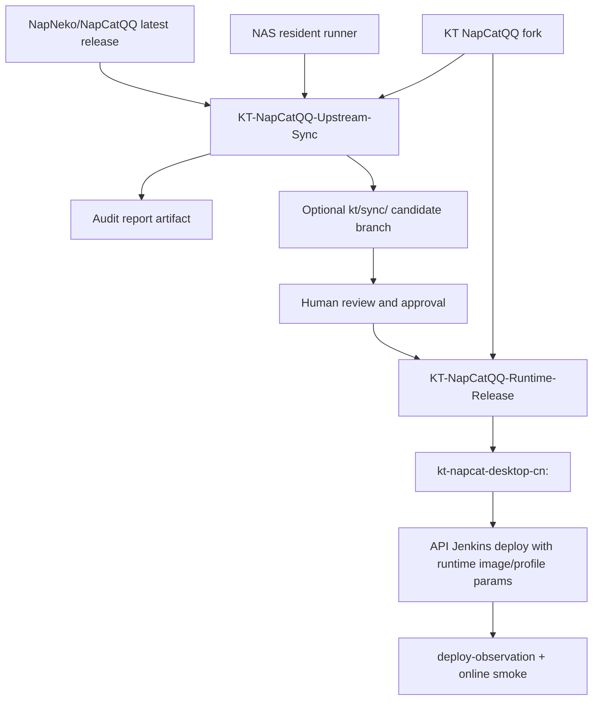
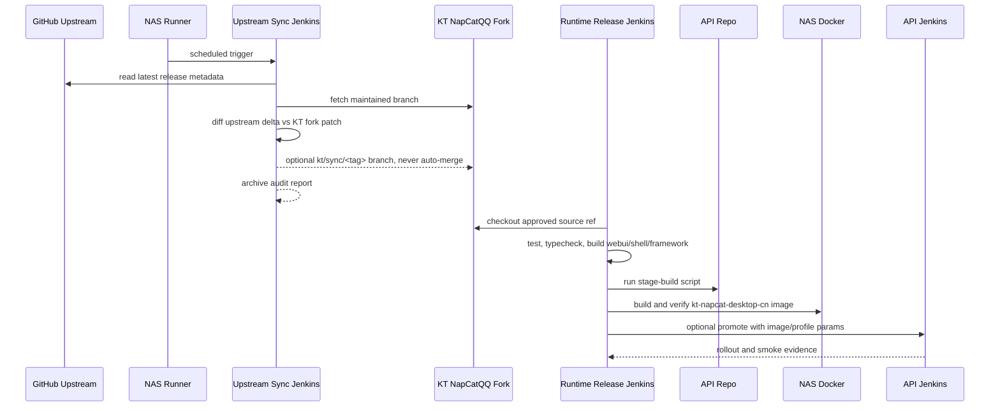

# NapCatQQ Upstream Sync and Runtime Release Pipeline Design

## Background

KT now carries a maintained `NapCatQQ` fork because QQ login, QR refresh, duplicate-login reset, and WebUI runtime state need source-level fixes. The production runtime image is a KT-derived Chinese desktop image:

```text
kt-napcat-desktop-cn:<profile>
```

The current release loop still has a manual gap:

1. Build the `NapCatQQ` fork locally.
2. Stage the `NapCat.Shell` artifact with the API repository script.
3. Copy or build the Docker context on the NAS.
4. Verify the image.
5. Update API runtime image/profile values.
6. Push API/Admin and observe Jenkins/K8s.

That is too easy to drift. It also does not answer a bigger operational question: when upstream `NapNeko/NapCatQQ` ships a new latest release, which upstream changes can KT safely sync, and which changes conflict with KT's forked login/runtime fixes?

This design makes `NapCatQQ` its own release unit and adds a separate upstream release audit loop. The audit loop is read-only by default. It never merges upstream into KT automatically.

The scheduled audit must not depend on the laptop. The laptop moves between networks and cannot be treated as a reliable scheduler or runner. The NAS becomes the resident execution node for scheduled checks, release artifacts, Docker image builds, and future remote Codex development sessions.

Primary upstream metadata sources:

- GitHub latest release REST API: `GET /repos/{owner}/{repo}/releases/latest`.
- GitHub compare REST API: `GET /repos/{owner}/{repo}/compare/{basehead}`.
- Local Git history checks: `git diff`, `git range-diff`, `git merge-tree`, and file-level hot-zone scans.

## Goals

1. Create an independent `NapCatQQ` Jenkins pipeline for fork validation and runtime image release.
2. Add a scheduled upstream latest-release audit that detects new upstream releases without automatically merging them.
3. Classify upstream changes as safe candidate, manual-review required, or blocked.
4. Produce auditable reports showing upstream deltas, KT fork patches, overlap files, hot-zone hits, and recommended action.
5. Build verified `kt-napcat-desktop-cn` images from selected KT fork refs.
6. Promote verified runtime images into API deployment through explicit parameters or promotion metadata, not ad hoc manifest edits.
7. Keep production release completion tied to online smoke evidence, not Jenkins/K8s success alone.
8. Install and configure a NAS-resident Codex CLI environment with a full KT workspace so remote development can continue when the laptop is unavailable.
9. Run scheduled upstream audits on the NAS through Jenkins or a NAS service timer, never from the laptop.
10. Put Codex CLI automation orchestration in `mcp/ktWorkflow`, including prompt templates, schemas, context collectors, and Jenkins/systemd command entry points.

## Non-Goals

- Do not bypass QQ/Tencent captcha, new-device verification, or account safety flows.
- Do not auto-merge upstream `release-latest` into KT's maintained branch.
- Do not push to the upstream `NapNeko/NapCatQQ` repository.
- Do not treat OneBot heartbeat as QQ account login success.
- Do not make the API repository own NapCat source patches.
- Do not store GitHub tokens, Jenkins credentials, SSH keys, WebUI tokens, or Docker registry credentials in Git.
- Do not automatically migrate existing production accounts to a new runtime image without explicit release confirmation.
- Do not store copied Codex secrets, sessions, logs, SQLite state, browser state, or auth files in Git or release artifacts.
- Do not run unattended Codex agent sessions that modify code or merge upstream without explicit human approval.
- Do not let Codex CLI automation read live credentials unless the prompt task explicitly needs them. Upstream release auditing should run from Git metadata and generated context packets.

## Repositories and Ownership

### `D:\MyFiles\KT\GitHub\NapCatQQ`

Owns KT's NapCat source fork and source-level tests.

Required remotes:

```text
upstream = https://github.com/NapNeko/NapCatQQ.git
origin   = KT writable mirror or fork repository
```

The current local `origin` may point at upstream. The implementation must correct that before any Jenkins push path is enabled. Jenkins must refuse to push if `origin` resolves to `NapNeko/NapCatQQ`.

Recommended long-lived branches:

```text
kt/runtime-maintenance
kt/sync/<upstream-release-tag>
kt/release/<runtime-profile>
```

### `D:\MyFiles\KT\Node\kt-template-online-api`

Owns:

- `scripts/napcat-desktop-cn-stage-build.mjs`
- `ci/napcat-desktop-cn/Dockerfile`
- `ci/napcat-desktop-cn/verify.sh`
- API runtime image/profile parameters and deployment contract
- API-side login/SSE safety guards

The API repository should not commit `NapCat.Shell.zip` artifacts.

### Jenkins and NAS Docker

Own:

- Scheduled upstream release audit execution.
- NapCat fork build/test execution.
- NAS-local Docker image build and verification.
- Runtime promotion metadata and deployment observation artifacts.

### `D:\MyFiles\KT\mcp\ktWorkflow`

Owns the automation control plane. Jenkins and NAS timers should call ktWorkflow instead of embedding bespoke shell logic.

Required capabilities:

- Generate upstream audit context packets from Git/GitHub facts.
- Run Codex CLI automation prompts with schema validation and artifact capture.
- Provide MCP tools for interactive use by Codex Desktop and CLI.
- Provide npm scripts for Jenkins/systemd, such as `napcat-upstream-audit`, `napcat-sync-candidate-review`, `napcat-runtime-release-readiness`, and `nas-codex-bootstrap`.
- Keep deterministic collectors, prompt templates, schemas, output normalization, and artifact writing in one reusable implementation.

The API repository remains the owner of runtime Docker integration and API deployment contract. It should not own the general automation runner.

### NAS Codex Worker and Full KT Workspace

The NAS must host a stable remote development and scheduled-audit environment. Current discovery shows:

```text
host: Tsukasa-NAS
os: Debian GNU/Linux 12 (bookworm), x86_64
available: git 2.43.0, Docker 28.5.2
missing: node, npm, pnpm, corepack, codex
laptop surface: Codex Desktop; local CLI wrapper currently reports codex-cli 0.131.0
```

Recommended resident layout:

```text
/vol1/docker/kt-codex/
  home/.codex/                 # CODEX_HOME for NAS, chmod 700
  workspace/KT/                # Full KT workspace checkout
  artifacts/                   # Audit and release artifacts
  logs/                        # Service logs, rotated
  jenkins-workspaces/          # Clean job-specific worktrees/checkouts
```

The NAS setup must install Node and Codex before enabling scheduled jobs:

1. Install Node on the NAS with a pinned version that satisfies KT engines, currently at least Node `>=20.19.0` for `mcp/ktWorkflow`.
2. Enable `corepack` and install `pnpm` according to each repository's `packageManager`.
3. Install the latest stable Codex CLI on the NAS. The laptop runs Codex Desktop, so NAS CLI does not need to match the Desktop wrapper version.
4. Verify `node --version`, `corepack --version`, `pnpm --version`, `git --version`, `docker --version`, and `codex --version`.

The KT workspace on NAS must be a real full checkout, not a copy of temporary laptop state. Implementation must create a workspace manifest that lists every KT subrepo path, remote, default branch, and writable/push policy. Repositories without a reliable remote must be called out explicitly before the first bootstrap. Ignored runtime folders such as `.kt-workspace`, build outputs, logs, sessions, and DB sync drafts must not be mirrored as source of truth.

Codex configuration parity is logical parity, not a byte-for-byte copy of the Windows profile:

- Copy or generate non-secret configuration for trusted KT projects, model defaults, approval policy, sandbox policy, Superpowers skills, custom KT skills, and `ktWorkflow` MCP.
- Convert Windows paths in `config.toml` to NAS Linux paths.
- Keep GUI-only integrations such as local browser, computer-use, and Windows Figma local context disabled unless a NAS-compatible backend is explicitly installed.
- Because the NAS is fully trusted, sensitive Codex files may be copied from the laptop when needed. The sync must still use a direct trusted channel, keep owner-only permissions, and exclude those files from Git, Jenkins artifacts, Docker build contexts, and public logs.
- Bootstrap Codex auth either by interactive `codex login` on NAS or by directly copying the required auth material into `CODEX_HOME` with `chmod 600`.
- Sessions, logs, SQLite state, browser state, and generated images may be copied only if they are useful for remote continuity; they remain local runtime state and must not become source-control or release artifacts.
- Keep `CODEX_HOME=/vol1/docker/kt-codex/home/.codex` for NAS services so scheduled jobs do not write into root's default home by accident.

The scheduled upstream audit should be deterministic shell/Jenkins work by default. Codex CLI is installed for remote development, review, and manual takeover, not for silent unattended code modification. If a future job invokes Codex non-interactively, it must run in a throwaway branch/worktree, emit a full artifact report, and require human review before commit, push, merge, or deployment.

The intended automation split is:

```text
ktWorkflow deterministic collector
  -> context packet with git/GitHub/build facts
  -> ktWorkflow Codex CLI prompt runner
  -> structured JSON/Markdown report
  -> human-approved follow-up action
```

This gives Codex CLI the parts it is good at: reading diffs, explaining risk, checking hot-zone interactions, drafting candidate actions, and writing handoff reports. It does not make Codex the authority that silently mutates production state.

## Pipeline Overview



Two Jenkins jobs are required:

```text
KT-NapCatQQ-Upstream-Sync
KT-NapCatQQ-Runtime-Release
```

The upstream sync job is scheduled and read-only by default. The runtime release job is manually triggered, or triggered by an approved candidate branch.

All scheduled executions run on the NAS. Jenkins is the preferred scheduler because it already owns build logs and artifacts. If Jenkins is unavailable for this job, use a NAS service timer such as `systemd` with the same script and artifact directory. The laptop may trigger jobs manually, but it must not be the scheduler.

## Upstream Sync Audit Job

### Trigger

- Scheduled on the NAS, for example once per day.
- Manual trigger with `UPSTREAM_RELEASE_TAG` override.

### Inputs

```text
UPSTREAM_REPO=NapNeko/NapCatQQ
FORK_BRANCH=kt/runtime-maintenance
LAST_ACCEPTED_UPSTREAM_BASE=<commit recorded from previous release marker>
UPSTREAM_RELEASE_TAG=<optional manual override>
CREATE_CANDIDATE_BRANCH=false by default
```

### Steps

1. Fetch upstream metadata.
   - If `UPSTREAM_RELEASE_TAG` is empty, call GitHub latest release API.
   - Resolve the release tag to a peeled commit with `git ls-remote --tags upstream <tag>^{}` or equivalent.
   - Record release name, tag, commit, published time, and release URL.

2. Fetch fork and upstream history.
   - Fetch `upstream`.
   - Fetch KT writable `origin`.
   - Checkout `FORK_BRANCH`.
   - Confirm working tree is clean.

3. Compute upstream delta.
   - `upstreamDelta = LAST_ACCEPTED_UPSTREAM_BASE..UPSTREAM_RELEASE_COMMIT`
   - Capture commits, changed files, rename/delete status, package lock changes, and hot-zone hits.

4. Compute KT fork patch set.
   - `forkPatch = LAST_ACCEPTED_UPSTREAM_BASE..FORK_BRANCH`
   - Capture KT-only commits and files.

5. Detect overlap and risk.
   - `overlapFiles = upstreamDelta.files intersect forkPatch.files`
   - `hotZoneFiles = upstreamDelta.files matching login/runtime/build patterns`
   - Run `git merge-tree` or an equivalent dry merge against the release commit.
   - Run `git range-diff` when a candidate rebase can be generated.

6. Classify the release.
   - `safe-candidate`: no hot-zone hit, no overlap with KT patch files, lockfile/build changes pass static checks.
   - `manual-review`: hot-zone touched, overlap touched, package/build graph changed, or range-diff is non-trivial.
   - `blocked`: dry merge conflicts, tests cannot install/build, artifact structure changed, or required upstream metadata cannot be verified.

7. Write artifacts.
   - Markdown human report.
   - JSON machine report.
   - File lists for upstream delta, fork patch, overlap, and hot zones.
   - Suggested next action.

8. Optionally create candidate branch.
   - Only allowed when classification is `safe-candidate` or manually requested.
   - Branch name: `kt/sync/<release-tag>`.
   - Candidate creation applies KT patches on top of upstream release without merging back to `FORK_BRANCH`.
   - Candidate branch must be pushed only to KT writable remote.
   - Candidate branch must never auto-merge.

9. Archive NAS-local artifacts.
   - Write reports under `/vol1/docker/kt-codex/artifacts/napcat-upstream-sync/<timestamp>`.
   - Jenkins must archive the same reports.
   - Reports must include the NAS runner hostname, Codex CLI version when available, Git version, and workspace manifest revision.
   - If Codex CLI automation is enabled, archive the exact prompt, context packet, JSONL event log, final response, and output schema validation result.

### Hot Zones

The audit treats these as high-risk areas:

```text
packages/napcat-core/**/login*
packages/napcat-core/**/qrcode*
packages/napcat-shell/**
packages/napcat-framework/**
packages/napcat-webui-backend/**/QQLogin*
packages/napcat-webui-backend/**/Data*
packages/napcat-webui-backend/**/auth*
packages/napcat-webui-frontend/**
packages/napcat-adapter/**
packages/napcat-onebot/**
packages/napcat-vite/**
package.json
pnpm-lock.yaml
tsconfig*.json
vite*.ts
```

This list is intentionally conservative. If upstream changes login state, QR generation, WebUI auth, OneBot startup, or build packaging, the sync must go through human review.

### Audit Report Contract

JSON artifact:

```json
{
  "upstream": {
    "repo": "NapNeko/NapCatQQ",
    "releaseTag": "v0.0.0",
    "releaseCommit": "0000000000000000000000000000000000000000",
    "publishedAt": "2026-06-24T00:00:00Z",
    "releaseUrl": "https://github.com/NapNeko/NapCatQQ/releases/tag/v0.0.0"
  },
  "fork": {
    "branch": "kt/runtime-maintenance",
    "headCommit": "0000000000000000000000000000000000000000",
    "lastAcceptedUpstreamBase": "0000000000000000000000000000000000000000"
  },
  "classification": "manual-review",
  "reasonCodes": ["HOT_ZONE_CHANGED", "FORK_PATCH_OVERLAP"],
  "upstreamChangedFiles": [],
  "forkPatchFiles": [],
  "overlapFiles": [],
  "hotZoneFiles": [],
  "candidateBranch": null,
  "recommendedAction": "Review hot-zone changes before creating a candidate branch."
}
```

The report must be safe to archive and share. It must not include tokens, secrets, private env files, QQ passwords, captcha tickets, or WebUI credentials.

## Runtime Release Job

### Trigger

- Manual trigger with an approved source ref.
- Optional upstream-sync trigger after a candidate branch is reviewed and approved.

### Inputs

```text
NAPCAT_SOURCE_REF=kt/runtime-maintenance or kt/sync/<tag>
UPSTREAM_RELEASE_TAG=<tag recorded in audit>
UPSTREAM_RELEASE_COMMIT=<commit recorded in audit>
RUNTIME_PROFILE=desktop-cn-vN
NAPCAT_BASE_IMAGE=mlikiowa/napcat-docker@sha256:<digest>
API_REF=main
PROMOTE_TO_API=false by default
CANARY_ACCOUNT_ID=<optional>
```

`NAPCAT_BASE_IMAGE` must resolve to a digest before Docker build. If the user chooses to base on `mlikiowa/napcat-docker:latest`, the pipeline must first pull it, resolve its `RepoDigest`, and use the digest in the actual Docker build and release marker.

### Steps

1. Checkout `NapCatQQ`.
   - Use KT writable fork remote.
   - Checkout `NAPCAT_SOURCE_REF`.
   - Confirm clean tree.
   - Record fork commit.

2. Install and verify source.
   - `pnpm install --frozen-lockfile`
   - Focused login/runtime tests.
   - `pnpm run typecheck`
   - `pnpm run build:webui`
   - `pnpm run build:shell`
   - `pnpm run build:framework`

3. Checkout API repository as a build integration dependency.
   - Use `API_REF`.
   - Run the stage-build script with `--napcat-root`.
   - Ensure the staged `fork-artifact.json` contains:
     - upstream release tag
     - upstream release commit
     - last accepted upstream base
     - fork commit
     - dist sha256
     - `napcat.mjs` sha256
     - base image digest
     - Jenkins build URL

4. Build NAS-local Docker image.
   - Build from staged context.
   - Tag immutable image:

     ```text
     kt-napcat-desktop-cn:<upstream-tag>-kt.<jenkins-build>
     ```

   - Tag promotion alias only after verify:

     ```text
     kt-napcat-desktop-cn:<runtime-profile>
     ```

5. Verify image.
   - Run a temporary container.
   - Execute `/ci/napcat-desktop-cn/verify.sh`.
   - Verify locale, timezone, fonts, XDG paths, hidden Docker markers, fork marker, artifact hash, and critical runtime symbols.
   - Remove temporary container.
   - Inspect image ID and digest-like local image ID.

6. Archive release metadata.
   - `napcat-runtime-release.json`
   - Docker image inspect output.
   - `fork-artifact.json`
   - test summaries.

7. Optional API promotion.
   - If `PROMOTE_TO_API=true`, trigger API Jenkins with runtime image/profile parameters.
   - API deploy must update K8s runtime env through a controlled deployment parameter or generated manifest overlay.
   - API deploy must not require hand-editing `k8s/prod/api.yaml` for every runtime image.

8. Deployment observation and smoke.
   - Run API `deploy-observation`.
   - Verify API `/health/runtime`.
   - Verify K8s deployment generation, pod image, ready replicas, restart count, and logs.
   - For QQ login behavior, complete only after a real account smoke or a clearly documented manual-scan wait state.

The runtime release job must use a clean NAS job workspace rather than the long-lived remote development workspace. This prevents a remote Codex session and a Jenkins release from modifying the same checkout at the same time.

## ktWorkflow Codex CLI Automation

Implementation should add a NapCat automation module inside `mcp/ktWorkflow`, for example:

```text
mcp/ktWorkflow/
  prompts/napcat/
    upstream-audit.md
    sync-candidate-review.md
    runtime-release-readiness.md
    remote-dev-handoff.md
    schemas/
      upstream-audit.schema.json
      runtime-release-readiness.schema.json
  src/tools/napcatAutomation.ts
  src/tools/napcatAutomation.types.ts
  src/tools/napcatAutomation.prompts.ts
```

Prompts and schemas are source-controlled because they are part of the automation contract. Secrets are never embedded in prompts. Each ktWorkflow tool must accept explicit inputs, generate a context packet, optionally call Codex CLI, validate the output schema, and write artifacts under `.kt-workspace` locally or `/vol1/docker/kt-codex/artifacts` on NAS.

MCP tools should include:

```text
kt_napcat_upstream_audit
kt_napcat_sync_candidate_review
kt_napcat_runtime_release_readiness
kt_napcat_remote_dev_handoff
kt_nas_codex_bootstrap_plan
```

CLI scripts should include:

```text
pnpm --dir mcp/ktWorkflow run napcat-upstream-audit -- --execute --artifact-root /vol1/docker/kt-codex/artifacts/napcat-upstream-sync
pnpm --dir mcp/ktWorkflow run napcat-sync-candidate-review -- --source-ref kt/sync/<tag>
pnpm --dir mcp/ktWorkflow run napcat-runtime-release-readiness -- --release-artifact <path>
pnpm --dir mcp/ktWorkflow run nas-codex-bootstrap -- --dry-run
```

The scripts are the only supported scheduler entry points. Jenkins and `systemd` should call these scripts and should not duplicate the audit algorithm.

### `upstream-audit.md`

Purpose: classify a new upstream latest release from already-collected facts.

Prompt contract:

```text
You are auditing whether KT's NapCatQQ fork can safely sync an upstream NapNeko/NapCatQQ release.

Inputs:
- Upstream release metadata.
- Last accepted upstream base.
- KT fork branch and head commit.
- Upstream changed file list and commit list.
- KT fork patch file list and commit list.
- Hot-zone file list.
- Dry merge or range-diff output.

Rules:
- Do not run merge, commit, push, deploy, or edit files.
- Do not infer success from missing data.
- Classify exactly one of: safe-candidate, manual-review, blocked.
- Explain every reasonCode with file-level evidence.
- Recommend next action: no-op, create candidate branch, request human review, or block.

Output:
- JSON matching mcp/ktWorkflow/prompts/napcat/schemas/upstream-audit.schema.json.
- A concise Markdown summary safe for Jenkins artifacts.
```

Recommended command shape on NAS:

```bash
CODEX_HOME=/vol1/docker/kt-codex/home/.codex \
codex exec \
  --cd /vol1/docker/kt-codex/workspace/KT \
  --profile-v2 automation \
  --sandbox workspace-write \
  --ask-for-approval never \
  --json \
  --ephemeral \
  --output-schema /vol1/docker/kt-codex/workspace/KT/mcp/ktWorkflow/prompts/napcat/schemas/upstream-audit.schema.json \
  --output-last-message "$ARTIFACT_DIR/codex-upstream-audit.md" \
  - < "$CONTEXT_PACKET"
```

ktWorkflow owns this command invocation and must capture the JSONL event stream. `workspace-write` is used so Codex can write only the requested report files under the job artifact directory. The prompt still forbids source edits and push/merge/deploy actions.

### `sync-candidate-review.md`

Purpose: review a generated `kt/sync/<release-tag>` candidate branch before any merge.

Prompt contract:

```text
Review the candidate branch against KT's NapCat login/runtime requirements.

Must inspect:
- login service reset behavior
- QR refresh and stale QR handling
- WebUI login runtime state
- captcha and new-device flow boundaries
- package/build output structure
- test delta and missing coverage

Must not:
- edit files
- commit
- push
- mark production ready

Output:
- Critical/Important findings first.
- Required tests before merge.
- Whether this candidate can proceed to manual code review.
```

### `runtime-release-readiness.md`

Purpose: decide whether a built runtime image can be promoted to API.

Inputs:

- NapCatQQ test/typecheck/build summaries.
- `fork-artifact.json`.
- Docker image inspect output.
- `verify.sh` output.
- API integration test output.
- planned runtime image/profile values.

Output must separate:

- source validation
- image validation
- API promotion readiness
- online smoke readiness
- rollback pointer

### `remote-dev-handoff.md`

Purpose: create a safe handoff when a human opens NAS Codex CLI for remote development.

It should summarize:

- active branch and dirty status for each repo
- relevant artifact directories
- latest Jenkins job state
- current blockers
- exact commands that are safe to run next

It must not ask Codex to modify files automatically.

## API Promotion Contract

The API Jenkinsfile should gain optional parameters:

```text
QQBOT_NAPCAT_IMAGE_OVERRIDE=
QQBOT_NAPCAT_DESKTOP_PROFILE_VERSION_OVERRIDE=
```

When set, the K8s deploy stage must apply these as runtime env values for the API deployment. The implementation may use a generated manifest overlay or `kubectl set env`, but it must leave secrets out of Git and record the effective values in deployment evidence.

API tests must enforce:

- Production no longer depends on `latest`.
- The runtime image override path is explicit.
- The default profile value is still a known safe fallback.
- The API code does not silently downgrade to older runtime profiles.

## Data Flow



## Error Handling

- GitHub API rate limit or outage: mark audit as `blocked` with retry advice; do not infer latest release from stale data unless explicitly allowed.
- NAS runner lacks Node, pnpm, Docker, Git, Codex, or KT workspace manifest: mark setup incomplete and do not enable the scheduled trigger.
- NAS Codex auth is missing: remote development is unavailable until interactive login or trusted auth-file sync completes; deterministic Jenkins audits may still run if they do not need Codex auth.
- NAS Codex config drifts from the generated template: fail the remote-development smoke and require config regeneration.
- ktWorkflow NapCat automation tool, prompt, or schema is missing: deterministic audit may still run, but AI-assisted classification is marked unavailable.
- Codex CLI output does not match the required schema: mark the audit `blocked` and archive the raw output for review.
- Laptop is offline or away from the LAN: scheduled audits and runtime release jobs must continue on NAS.
- Upstream release has no resolvable tag commit: mark `blocked`.
- Fork writable remote points to upstream: fail before push.
- Dirty workspace: fail before audit candidate or release.
- Hot-zone overlap: mark `manual-review`; do not create or merge a candidate unless explicitly requested.
- Dry merge conflict: mark `blocked`.
- `pnpm install`, tests, typecheck, shell/framework build failure: mark runtime release failed; do not build or promote an image.
- Docker base image cannot resolve to digest: fail before build.
- `verify.sh` fails: remove verify container, keep artifacts, do not tag promotion alias.
- API promotion deploy succeeds but online smoke fails: keep deployment evidence separate from functional completion and provide rollback steps.

## Rollback

Runtime rollback is controlled by the API runtime image/profile values:

1. Identify the last verified runtime image/profile from release artifacts.
2. Trigger API Jenkins with previous `QQBOT_NAPCAT_IMAGE_OVERRIDE` and profile.
3. Observe K8s rollout.
4. Existing online NapCat containers are not automatically rebuilt. Account-level migration remains explicit because container rebuilds affect QQ device/login risk.

## Validation Strategy

### Upstream Sync Job

Local/job validation:

```powershell
pnpm --dir mcp/ktWorkflow run self-test
git diff --check
```

Jenkins dry run must show:

- Latest release metadata resolved.
- Last accepted upstream base resolved.
- Upstream delta file list.
- Fork patch file list.
- Overlap/hot-zone classification.
- Report artifact paths.
- NAS runner hostname and artifact directory.
- Workspace manifest revision.

### NAS Codex and Workspace

NAS setup validation:

```bash
node --version
corepack --version
pnpm --version
git --version
docker --version
codex --version
cd /vol1/docker/kt-codex/workspace/KT
git status --short --branch
pnpm --dir mcp/ktWorkflow run self-test
```

Remote development smoke:

- `codex --version` reports the latest installed NAS CLI version.
- `CODEX_HOME` points at `/vol1/docker/kt-codex/home/.codex`.
- `ktWorkflow` MCP can start from Linux paths.
- A dry-run upstream audit can write reports into `/vol1/docker/kt-codex/artifacts`.
- No laptop-only Windows path remains in the NAS `config.toml`.

Codex automation prompt smoke:

```bash
CODEX_HOME=/vol1/docker/kt-codex/home/.codex \
codex exec --cd /vol1/docker/kt-codex/workspace/KT \
  --profile-v2 automation \
  --sandbox workspace-write \
  --ask-for-approval never \
  --json \
  --ephemeral \
  --output-schema /vol1/docker/kt-codex/workspace/KT/mcp/ktWorkflow/prompts/napcat/schemas/upstream-audit.schema.json \
  --output-last-message /vol1/docker/kt-codex/artifacts/smoke/codex-upstream-audit.md \
  - < /vol1/docker/kt-codex/artifacts/smoke/context-packet.md
```

Expected result: schema-valid JSON, no source changes, and a Markdown report in the artifact directory. The preferred smoke is through ktWorkflow:

```bash
pnpm --dir /vol1/docker/kt-codex/workspace/KT/mcp/ktWorkflow run napcat-upstream-audit -- --dry-run --use-codex
```

### Runtime Release Job

NapCatQQ:

```powershell
corepack pnpm install --frozen-lockfile
corepack pnpm --filter napcat-test run test -- loginQrcodeRefresh webuiLoginSourceWiring webuiQQLoginHandlers webuiLoginRuntime
corepack pnpm run typecheck
corepack pnpm run build:webui
corepack pnpm run build:shell
corepack pnpm run build:framework
```

API integration:

```powershell
corepack pnpm exec jest test/modules/qqbot/napcat/napcat-desktop-cn-image.spec.ts test/modules/qqbot/napcat/runtime-protocol-profile.spec.ts --runTestsByPath --runInBand
corepack pnpm run typecheck
git diff --check
```

NAS image:

```bash
docker build --build-arg NAPCAT_BASE_IMAGE="$NAPCAT_BASE_IMAGE_DIGEST" -t "$IMMUTABLE_TAG" -f "$STAGED_CONTEXT/ci/napcat-desktop-cn/Dockerfile" "$STAGED_CONTEXT"
docker run -d --name "$VERIFY_CONTAINER" "$IMMUTABLE_TAG"
docker exec "$VERIFY_CONTAINER" sh /ci/napcat-desktop-cn/verify.sh
docker rm -f "$VERIFY_CONTAINER"
docker tag "$IMMUTABLE_TAG" "$PROMOTION_TAG"
```

Online:

- API `deploy-observation` passes.
- API `/health/runtime` passes.
- For login-runtime releases, a canary account either logs in successfully or reaches a clear captcha/new-device/manual-scan pending state with a fresh QR and correct SSE/Admin status.

## Completion Criteria

- `NapCatQQ` has a standalone Jenkins release path.
- NAS has a resident Codex CLI and full KT workspace environment for scheduled audits and remote development.
- A scheduled audit detects upstream latest releases and writes safe reports.
- The scheduled audit runs from NAS service/Jenkins, not from the laptop.
- Codex CLI automation runs through ktWorkflow; prompts are versioned, schema-validated, and archived with every AI-assisted audit.
- Upstream sync never auto-merges into KT maintenance branches.
- Hot-zone conflicts are blocked or marked for manual review.
- Runtime images are built from approved fork refs and verified inside containers.
- API deployment consumes runtime image/profile through an explicit promotion contract.
- Jenkins/K8s deployment evidence and online QQBot/NapCat smoke evidence are both captured before claiming a release complete.
