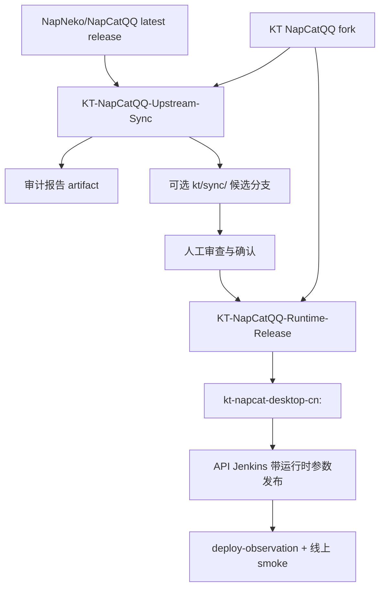
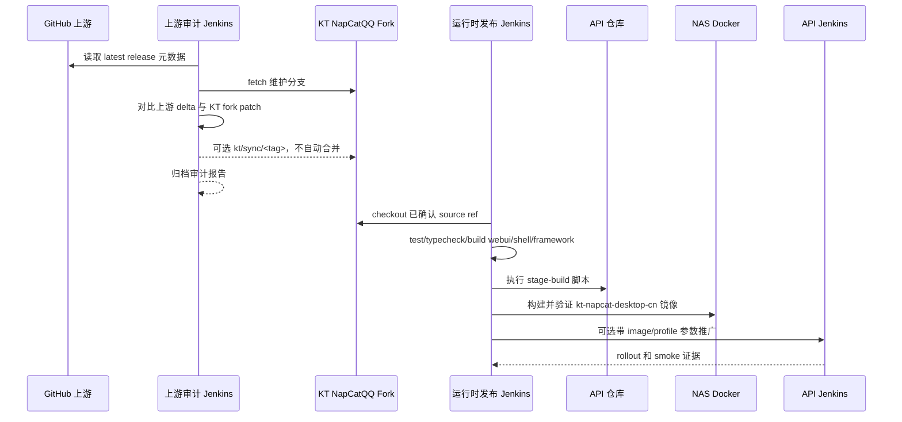

# NapCatQQ 上游同步与运行时发布流水线设计

## 背景

KT 现在已经维护了自己的 `NapCatQQ` fork，因为 QQ 登录、二维码刷新、重复登录状态重置、WebUI 登录运行态这些问题必须在源码层修。生产运行时镜像是 KT 派生的中文桌面镜像：

```text
kt-napcat-desktop-cn:<profile>
```

目前发布链路还有一段人工操作：

1. 本地构建 `NapCatQQ` fork。
2. 用 API 仓库脚本 staging `NapCat.Shell` artifact。
3. 在 NAS 上构建 Docker context。
4. 验证镜像。
5. 修改 API 的运行时镜像/profile。
6. 推送 API/Admin 并观察 Jenkins/K8s。

这段人工链路容易漂移。更重要的是，当上游 `NapNeko/NapCatQQ` 发布新的 latest release 时，我们必须知道“哪些上游改动能同步，哪些会撞上 KT fork 的登录/二维码补丁”，不能无脑合并上游。

本设计把 `NapCatQQ` fork 变成独立发布单元，并新增一个上游 release 审计循环。审计循环默认只读，只产报告和候选分支，绝不自动合并到 KT 维护分支。

主要上游元数据来源：

- GitHub latest release REST API：`GET /repos/{owner}/{repo}/releases/latest`。
- GitHub compare REST API：`GET /repos/{owner}/{repo}/compare/{basehead}`。
- 本地 Git 检查：`git diff`、`git range-diff`、`git merge-tree`、文件级 hot zone 扫描。

## 目标

1. 给 `NapCatQQ` 建独立 Jenkins 流水线，负责 fork 验证和运行时镜像发布。
2. 增加定时上游 latest release 审计，发现新 release 但不自动合并。
3. 把上游改动分成：可生成候选、必须人工审查、阻断。
4. 生成可审计报告：上游 delta、KT fork patch、重叠文件、hot zone 命中、推荐动作。
5. 从已确认的 KT fork ref 构建并验证 `kt-napcat-desktop-cn` 镜像。
6. 通过显式参数或发布元数据把已验证镜像推广到 API 部署，不再手工临时改 manifest。
7. 线上完成标准必须包含真实 smoke，不把 Jenkins/K8s 成功当成功能闭环。

## 非目标

- 不绕过 QQ/Tencent 验证码、新设备验证或账号安全流程。
- 不自动把 upstream `release-latest` 合并到 KT 维护分支。
- 不向上游 `NapNeko/NapCatQQ` 仓库推送。
- 不把 OneBot 心跳当作 QQ 账号登录成功。
- 不让 API 仓库持有 NapCat 源码补丁。
- 不把 GitHub token、Jenkins 凭证、SSH key、WebUI token、Docker registry 凭证写进 Git。
- 不在没有明确确认时自动迁移线上账号到新运行时镜像。

## 仓库职责

### `D:\MyFiles\KT\GitHub\NapCatQQ`

负责 KT 的 NapCat 源码 fork 和源码级测试。

需要的 remote：

```text
upstream = https://github.com/NapNeko/NapCatQQ.git
origin   = KT 可写 mirror 或 fork 仓库
```

当前本地 `origin` 可能指向上游。实现阶段必须先修正这一点。Jenkins 如果发现 `origin` 指向 `NapNeko/NapCatQQ`，必须拒绝 push。

建议长期分支：

```text
kt/runtime-maintenance
kt/sync/<upstream-release-tag>
kt/release/<runtime-profile>
```

### `D:\MyFiles\KT\Node\kt-template-online-api`

负责：

- `scripts/napcat-desktop-cn-stage-build.mjs`
- `ci/napcat-desktop-cn/Dockerfile`
- `ci/napcat-desktop-cn/verify.sh`
- API 运行时镜像/profile 参数与部署契约
- API 侧登录/SSE 防旧码护栏

API 仓库不提交 `NapCat.Shell.zip` 二进制 artifact。

### Jenkins 与 NAS Docker

负责：

- 定时执行上游 release 审计。
- 执行 NapCat fork 构建、测试和类型检查。
- 在 NAS 本地构建并验证 Docker 镜像。
- 保存运行时发布元数据和部署观测 artifact。

## 流水线总览



需要两个 Jenkins job：

```text
KT-NapCatQQ-Upstream-Sync
KT-NapCatQQ-Runtime-Release
```

上游同步 job 定时执行，默认只读。运行时发布 job 手动触发，或者由已经人工确认的候选分支触发。

## 上游同步审计 Job

### 触发方式

- 定时触发，例如每天一次。
- 手动触发，可指定 `UPSTREAM_RELEASE_TAG`。

### 输入

```text
UPSTREAM_REPO=NapNeko/NapCatQQ
FORK_BRANCH=kt/runtime-maintenance
LAST_ACCEPTED_UPSTREAM_BASE=<上一次已接入 release marker 里的 commit>
UPSTREAM_RELEASE_TAG=<可选手动指定>
CREATE_CANDIDATE_BRANCH=false
```

### 步骤

1. 获取上游元数据。
   - 如果 `UPSTREAM_RELEASE_TAG` 为空，调用 GitHub latest release API。
   - 把 release tag 解析成 peeled commit。
   - 记录 release 名称、tag、commit、发布时间和 release URL。

2. 拉取 fork 与上游历史。
   - fetch `upstream`。
   - fetch KT 可写 `origin`。
   - checkout `FORK_BRANCH`。
   - 确认工作区干净。

3. 计算上游 delta。
   - `upstreamDelta = LAST_ACCEPTED_UPSTREAM_BASE..UPSTREAM_RELEASE_COMMIT`
   - 记录 commit、变更文件、rename/delete、lockfile 变化、hot zone 命中。

4. 计算 KT fork patch。
   - `forkPatch = LAST_ACCEPTED_UPSTREAM_BASE..FORK_BRANCH`
   - 记录 KT-only commit 和文件。

5. 检测重叠和风险。
   - `overlapFiles = 上游 delta 文件 ∩ KT patch 文件`
   - `hotZoneFiles = 上游 delta 中命中登录/运行时/构建模式的文件`
   - 运行 `git merge-tree` 或等价 dry merge。
   - 能生成候选 rebase 时运行 `git range-diff`。

6. 分类 release。
   - `safe-candidate`：没有 hot zone、没有 KT patch 文件重叠、lockfile/build 变化通过静态检查。
   - `manual-review`：命中 hot zone、命中重叠、package/build 图变化、或 range-diff 不平凡。
   - `blocked`：dry merge 冲突、依赖安装/构建失败、artifact 结构变化、上游元数据无法验证。

7. 输出 artifact。
   - Markdown 人类报告。
   - JSON 机器报告。
   - 上游 delta、KT patch、重叠文件、hot zone 文件列表。
   - 推荐下一步动作。

8. 可选创建候选分支。
   - 只有 `safe-candidate` 或人工显式要求时允许。
   - 分支名：`kt/sync/<release-tag>`。
   - 候选分支是在上游 release 上应用 KT patch，不合回 `FORK_BRANCH`。
   - 候选分支只能推到 KT 可写 remote。
   - 候选分支永远不能自动 merge。

### Hot Zone

这些路径视为高风险区域：

```text
packages/napcat-core/**/login*
packages/napcat-core/**/qrcode*
packages/napcat-shell/**
packages/napcat-framework/**
packages/napcat-webui-backend/**/QQLogin*
packages/napcat-webui-backend/**/Data*
packages/napcat-webui-backend/**/auth*
packages/napcat-webui-frontend/**
packages/napcat-adapter/**
packages/napcat-onebot/**
packages/napcat-vite/**
package.json
pnpm-lock.yaml
tsconfig*.json
vite*.ts
```

这份列表故意保守。只要上游改到登录状态、二维码生成、WebUI auth、OneBot 启动或构建打包，就必须人工审查。

### 审计报告契约

JSON artifact：

```json
{
  "upstream": {
    "repo": "NapNeko/NapCatQQ",
    "releaseTag": "v0.0.0",
    "releaseCommit": "0000000000000000000000000000000000000000",
    "publishedAt": "2026-06-24T00:00:00Z",
    "releaseUrl": "https://github.com/NapNeko/NapCatQQ/releases/tag/v0.0.0"
  },
  "fork": {
    "branch": "kt/runtime-maintenance",
    "headCommit": "0000000000000000000000000000000000000000",
    "lastAcceptedUpstreamBase": "0000000000000000000000000000000000000000"
  },
  "classification": "manual-review",
  "reasonCodes": ["HOT_ZONE_CHANGED", "FORK_PATCH_OVERLAP"],
  "upstreamChangedFiles": [],
  "forkPatchFiles": [],
  "overlapFiles": [],
  "hotZoneFiles": [],
  "candidateBranch": null,
  "recommendedAction": "Review hot-zone changes before creating a candidate branch."
}
```

报告必须可归档、可分享，不包含 token、secret、私有 env、QQ 密码、验证码 ticket 或 WebUI credential。

## 运行时发布 Job

### 触发方式

- 手动指定已确认的 source ref。
- 候选分支审查通过后可触发。

### 输入

```text
NAPCAT_SOURCE_REF=kt/runtime-maintenance or kt/sync/<tag>
UPSTREAM_RELEASE_TAG=<审计报告里的 tag>
UPSTREAM_RELEASE_COMMIT=<审计报告里的 commit>
RUNTIME_PROFILE=desktop-cn-vN
NAPCAT_BASE_IMAGE=mlikiowa/napcat-docker@sha256:<digest>
API_REF=main
PROMOTE_TO_API=false
CANARY_ACCOUNT_ID=<可选>
```

`NAPCAT_BASE_IMAGE` 必须在 Docker build 前解析为 digest。如果选择基于 `mlikiowa/napcat-docker:latest`，流水线必须先 pull，再解析 `RepoDigest`，实际构建和 release marker 都使用 digest。

### 步骤

1. Checkout `NapCatQQ`。
   - 使用 KT 可写 fork remote。
   - checkout `NAPCAT_SOURCE_REF`。
   - 确认工作区干净。
   - 记录 fork commit。

2. 安装和验证源码。
   - `pnpm install --frozen-lockfile`
   - 登录/运行态聚焦测试。
   - `pnpm run typecheck`
   - `pnpm run build:webui`
   - `pnpm run build:shell`
   - `pnpm run build:framework`

3. Checkout API 仓库作为构建集成依赖。
   - 使用 `API_REF`。
   - 执行 stage-build 脚本并传入 `--napcat-root`。
   - staged `fork-artifact.json` 必须包含：
     - upstream release tag
     - upstream release commit
     - last accepted upstream base
     - fork commit
     - dist sha256
     - `napcat.mjs` sha256
     - base image digest
     - Jenkins build URL

4. 构建 NAS 本地 Docker 镜像。
   - 从 staged context 构建。
   - 先打不可变 tag：

     ```text
     kt-napcat-desktop-cn:<upstream-tag>-kt.<jenkins-build>
     ```

   - verify 通过后再打推广别名：

     ```text
     kt-napcat-desktop-cn:<runtime-profile>
     ```

5. 验证镜像。
   - 起临时容器。
   - 执行 `/ci/napcat-desktop-cn/verify.sh`。
   - 验证 locale、时区、字体、XDG、容器隐藏标记、fork marker、artifact hash、关键 runtime symbol。
   - 删除临时容器。
   - 记录 image ID。

6. 归档 release 元数据。
   - `napcat-runtime-release.json`
   - Docker image inspect 输出
   - `fork-artifact.json`
   - 测试摘要

7. 可选推广到 API。
   - `PROMOTE_TO_API=true` 时，触发 API Jenkins，并传入 runtime image/profile 参数。
   - API 发布阶段通过受控参数或生成 overlay 更新 K8s runtime env。
   - 不要求每次手工编辑 `k8s/prod/api.yaml`。

8. 部署观测和 smoke。
   - 执行 API `deploy-observation`。
   - 验证 API `/health/runtime`。
   - 验证 K8s deployment generation、pod image、ready replicas、restart count 和日志。
   - 涉及 QQ 登录行为时，必须等真实账号 smoke 或明确记录“等待人工扫码”的状态，不能只凭 Jenkins/K8s 完成。

## API 推广契约

API Jenkinsfile 增加可选参数：

```text
QQBOT_NAPCAT_IMAGE_OVERRIDE=
QQBOT_NAPCAT_DESKTOP_PROFILE_VERSION_OVERRIDE=
```

设置后，K8s deploy 阶段必须把它们作为 API deployment 的运行时 env。实现可以用 generated manifest overlay，也可以用 `kubectl set env`，但不能把 secret 写进 Git，并且要在部署证据里记录最终生效值。

API 测试需要保证：

- 生产不依赖 `latest`。
- runtime image override 路径显式存在。
- 默认 profile 仍是已知安全 fallback。
- API 不会静默降级到旧 runtime profile。

## 数据流



## 错误处理

- GitHub API 限流或不可用：审计标记 `blocked`，给出重试建议；除非明确允许，不用陈旧数据推断 latest。
- 上游 release tag 无法解析 commit：标记 `blocked`。
- fork 可写 remote 指向上游：push 前失败。
- 工作区不干净：候选或发布前失败。
- 命中 hot-zone overlap：标记 `manual-review`，除非人工明确要求，否则不创建、不合并候选。
- dry merge 冲突：标记 `blocked`。
- `pnpm install`、测试、typecheck、shell/framework 构建失败：发布失败，不构建、不推广镜像。
- Docker base image 不能解析 digest：build 前失败。
- `verify.sh` 失败：删除验证容器，保留 artifact，不打推广 tag。
- API 推广部署成功但线上 smoke 失败：部署证据和功能闭环分开记录，并给出回滚步骤。

## 回滚

运行时回滚由 API runtime image/profile 控制：

1. 从 release artifact 找到上一个已验证 runtime image/profile。
2. 触发 API Jenkins，传入旧的 `QQBOT_NAPCAT_IMAGE_OVERRIDE` 和 profile。
3. 观察 K8s rollout。
4. 已存在的线上 NapCat 容器不自动重建。账号级迁移必须显式执行，因为容器重建会影响 QQ 设备/登录风控。

## 验证策略

### 上游同步 Job

本地/job 验证：

```powershell
pnpm --dir mcp/ktWorkflow run self-test
git diff --check
```

Jenkins dry run 必须看到：

- latest release 元数据已解析。
- last accepted upstream base 已解析。
- 上游 delta 文件列表。
- KT fork patch 文件列表。
- overlap/hot-zone 分类。
- 报告 artifact 路径。

### 运行时发布 Job

NapCatQQ：

```powershell
corepack pnpm install --frozen-lockfile
corepack pnpm --filter napcat-test run test -- loginQrcodeRefresh webuiLoginSourceWiring webuiQQLoginHandlers webuiLoginRuntime
corepack pnpm run typecheck
corepack pnpm run build:webui
corepack pnpm run build:shell
corepack pnpm run build:framework
```

API 集成：

```powershell
corepack pnpm exec jest test/modules/qqbot/napcat/napcat-desktop-cn-image.spec.ts test/modules/qqbot/napcat/runtime-protocol-profile.spec.ts --runTestsByPath --runInBand
corepack pnpm run typecheck
git diff --check
```

NAS 镜像：

```bash
docker build --build-arg NAPCAT_BASE_IMAGE="$NAPCAT_BASE_IMAGE_DIGEST" -t "$IMMUTABLE_TAG" -f "$STAGED_CONTEXT/ci/napcat-desktop-cn/Dockerfile" "$STAGED_CONTEXT"
docker run -d --name "$VERIFY_CONTAINER" "$IMMUTABLE_TAG"
docker exec "$VERIFY_CONTAINER" sh /ci/napcat-desktop-cn/verify.sh
docker rm -f "$VERIFY_CONTAINER"
docker tag "$IMMUTABLE_TAG" "$PROMOTION_TAG"
```

线上：

- API `deploy-observation` 通过。
- API `/health/runtime` 通过。
- 登录运行时发布必须用 canary 账号验证：要么真实登录成功，要么进入清晰的验证码/新设备/人工扫码 pending 状态，且二维码必须是 fresh，SSE/Admin 状态必须正确。

## 完成标准

- `NapCatQQ` 有独立 Jenkins 发布链路。
- 定时审计能发现上游 latest release 并生成安全报告。
- 上游同步不会自动合并进 KT 维护分支。
- hot-zone 冲突会阻断或进入人工审查。
- 运行时镜像只从已确认 fork ref 构建，并经过容器内 verify。
- API 部署通过显式 image/profile 推广契约消费运行时镜像。
- Jenkins/K8s 部署证据和线上 QQBot/NapCat smoke 证据都齐全后，才允许宣称发布完成。
